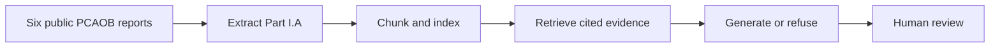
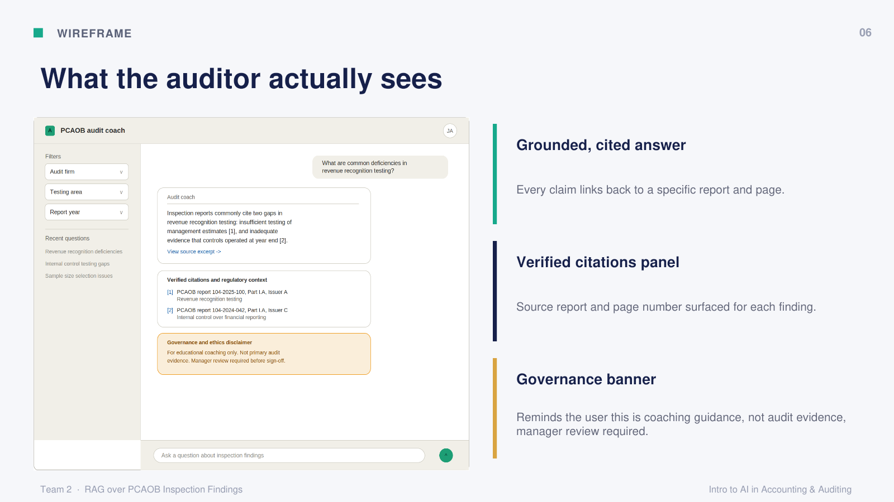
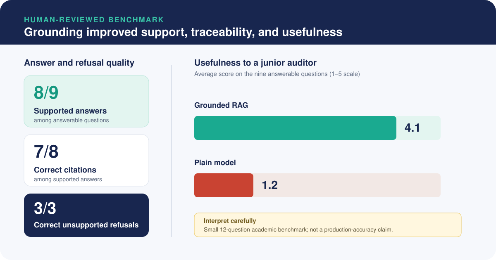

# PCAOB RAG Audit Assistant

[Open portfolio demo](https://jeffrey-case-pcaob-audit.budrock.chatgpt.site) · [Original Streamlit demo](https://pcaob-rag-audit-assistant.streamlit.app/)

The updated portfolio opens without a Streamlit wake-up screen. Both versions present the same saved, reviewed examples; the original Streamlit address remains available.

An academic audit-research prototype that retrieves relevant PCAOB inspection findings before asking a language model to answer. The objective is to make selected findings easier for a junior auditor to locate, understand, and verify.

I developed this prototype as part of a four-person Rutgers Master of Accountancy in Accounting & Analytics team using extensive AI coding assistance. ChatGPT generated the Python implementation; I directed and reviewed the workflow, ran and tested the prototype, verified outputs against PCAOB sources, evaluated the results, and presented the architecture. After the course submission, I independently converted the work into this public portfolio edition with AI assistance.

## The business problem

PCAOB inspection reports contain practical examples of audit deficiencies, but the findings are spread across lengthy reports and are not organized as a training tool. A junior auditor researching revenue testing may need to locate relevant passages across several firms and years, interpret the issue, and retain a clear path back to the source.

This prototype tests whether retrieval-augmented generation (RAG) can support that research process by:

- finding relevant report passages first
- generating a concise explanation from only those passages
- attaching report-and-page citations to substantive claims; and
- refusing questions the selected reports cannot support.

The PCAOB inspects portions of registered firms' audit work and elements of their quality-control systems to assess compliance with applicable laws, rules, and professional standards. That makes the public reports useful, real-world material for studying audit-quality issues. They are not balanced firm report cards or a basis for ranking overall firm quality. See the [PCAOB inspection overview](https://pcaobus.org/oversight/inspections) and [inspection-report caution](https://pcaobus.org/oversight/inspections/basics-of-inspections).

## Prototype scope

| Item | Scope |
|---|---|
| Reports | Six public PCAOB inspection reports |
| Firms | Deloitte & Touche LLP and Ernst & Young LLP |
| Inspection years | 2022–2024 |
| Audit topic | Revenue-related findings in Part I.A |
| Benchmark | 12 questions: 9 answerable and 3 intentionally unsupported |
| Intended user | Junior auditor seeking training or research support |

## What the tool does

1. Downloads the six reports from official PCAOB links.
2. Extracts the detailed Part I.A pages and preserves report/page metadata.
3. Splits relevant text into overlapping passages of approximately 350 words.
4. Indexes the passages using both TF-IDF and semantic embeddings.
5. Retrieves up to six unique cited pages for a question.
6. Searches each firm separately and merges results for cross-firm questions.
7. Gives only the retrieved passages to Gemini, together with strict citation and refusal instructions.
8. Saves outputs for automated checks and human review.

This is an open-book workflow. The retriever opens the relevant pages, and the language model writes from those pages.



## Concept interface

The original team presentation included this wireframe to translate the technical pipeline into an auditor-facing experience. The Streamlit demo in this repository implements the same core ideas using saved, human-reviewed examples.



## Technologies used

| Technology | Role in the prototype |
|---|---|
| Python and pandas | Data preparation, orchestration, and evaluation |
| PyMuPDF | Page-level PDF text extraction |
| TF-IDF | Transparent keyword and phrase retrieval baseline |
| Sentence Transformers | Semantic retrieval using `all-MiniLM-L6-v2` embeddings |
| Gemini | Grounded answer generation and plain-model comparison |
| Streamlit | Lightweight recruiter-facing demonstration |
| pytest | Regression tests for scope inference, retrieval balance, prompts, and metrics |

The optional live-generation path uses Google's `google-genai` SDK and sets `store=False` on the Interaction request. See the official [Gemini Interactions API documentation](https://ai.google.dev/gemini-api/docs/interactions-overview).

## Evaluation methodology

I created a fixed 12-question benchmark rather than demonstrating only favorable examples:

- **Nine answerable questions** were tied to a defined firm, year, topic, and expected evidence.
- **Three intentionally unsupported questions** tested whether the system would refuse requests for anonymized issuer names, an undisclosed dollar amount, and an overall firm-quality ranking.
- Retrieval was assessed separately from generation so a failure could be traced to the correct stage.
- RAG answers were compared with the same Gemini model answering without retrieved PCAOB excerpts.
- Human review assessed factual support, citation accuracy, usefulness to a junior auditor, and refusal behavior.

The benchmark questions are available in [`results/benchmark_questions.json`](results/benchmark_questions.json).

## Key results



| Measure | Human-reviewed result |
|---|---:|
| Predefined retrieval checks passed | 12/12 |
| Supported answers among answerable questions | 8/9 |
| Correct citations among supported answers | 7/8 |
| Unsupported questions correctly refused | 3/3 |
| Correct overall RAG behavior | 11/12 |
| Average usefulness: grounded RAG | 4.11/5 |
| Average usefulness: plain model | 1.22/5 |
| Plain-model answers verifiably supported by the selected reports | 0/9 |

The first retrieval prototype passed 10 of 12 checks. Both misses involved cross-firm questions in which one firm's results crowded out the other. Retrieving separately by firm and then merging the results raised the final benchmark result to 12 of 12.

### What did not work perfectly

- **Q07 — citation formatting:** The answer was supported, but one citation label was malformed. Automated citation-presence checks did not fully capture that issue; human review did.
- **Q08 — over-refusal:** The retriever surfaced the correct EY 2022 evidence, but Gemini still refused to answer. This was recorded as a generation failure, not a retrieval failure.

These exceptions are important: finding the correct evidence does not guarantee that a language model will use it correctly.

## Run the recruiter demo

### Static portfolio edition

Open the [portfolio demo](https://jeffrey-case-pcaob-audit.budrock.chatgpt.site) to explore the project without an API key or application wake-up screen.

The `portfolio/` interface presents the same four saved, human-reviewed examples, with direct links to the cited PDF pages and separate metrics for answer support and citation accuracy. It uses no model API or running Python server when hosted. Source notes may be abridged; the original report is the authoritative source. The benchmark results and saved model answers are unchanged.

Build and preview it with Python's standard library:

```bash
python scripts/build_portfolio.py
python -m http.server 8765 --directory dist
```

Open `http://localhost:8765`. The generated `dist/` folder can be served by a static host without an application wake-up screen. The build reads the existing demo and evaluation JSON files, so it does not duplicate the recorded answers or results in a separate data source.

For GitHub Pages, regenerate the published files after editing the portfolio template, assets, saved examples, or evaluation summary:

```bash
python scripts/build_portfolio.py --output docs
```

Commit the generated files in `docs/` together with the source changes. The Pages publishing source is `main` → `/docs`. The builder preserves `docs/GOVERNANCE.md` and writes `.nojekyll` so GitHub serves the static files directly. The default `dist/` build and original Streamlit application remain available.

### Original Streamlit edition

Open the [original Streamlit demo](https://pcaob-rag-audit-assistant.streamlit.app/), or run it locally using the instructions below. This address is retained for existing links and includes a link to the updated portfolio. The Streamlit app uses reviewed, saved examples. It does not require an API key and does not send questions to an external model.

```bash
git clone https://github.com/JeffreyCase/pcaob-rag-audit-assistant.git
cd pcaob-rag-audit-assistant
python -m venv .venv
```

Activate the environment:

```bash
# macOS or Linux
source .venv/bin/activate

# Windows PowerShell
.venv\Scripts\Activate.ps1
```

Install and launch:

```bash
pip install -r requirements.txt
streamlit run app.py
```

### Optional live query

Live generation is not needed to review the portfolio. To reproduce the document pipeline and run a new question:

```bash
pip install -r requirements-pipeline.txt
pip install -e .
python scripts/build_corpus.py
```

Set `GEMINI_API_KEY` in your local environment—never in committed code—and then run:

```bash
python scripts/run_live_query.py "What revenue-related data reliability issues appeared in the selected reports?"
```

Downloaded PDFs, processed chunks, model files, output folders, and `.env` files are excluded from version control.

## Repository structure

```text
pcaob-rag-audit-assistant/
├── app.py                         # Precomputed Streamlit portfolio demo
├── assets/                        # README visuals
├── config/reports.json            # Official PCAOB report manifest
├── data/demo_answers.json         # Curated, reviewed examples only
├── docs/GOVERNANCE.md             # Production risks and control considerations
├── notebooks/pcaob_rag_demo.ipynb # Clean project walkthrough
├── portfolio/                    # Static demonstration template and assets
├── results/                       # Benchmark questions and summary metrics
├── scripts/                       # Corpus build and optional live query
├── src/pcaob_rag/                 # Extraction, retrieval, generation, evaluation
├── tests/                         # Lightweight regression tests
├── .env.example
├── requirements.txt               # Lightweight Streamlit demo dependency
└── requirements-pipeline.txt      # Full extraction, retrieval, and generation stack
```

## Limitations

- Six reports, two firms, three inspection years, and one audit topic are not representative of all firms or engagements.
- The 12-question benchmark is too small to establish general or production accuracy.
- Inspection-report headings and formatting may change, making PDF extraction brittle.
- Firm and year scope detection is rule-based and intentionally limited to the selected corpus.
- The generator can over-refuse or format citations incorrectly even when retrieval succeeds.
- Automated citation checks confirm format and allowed labels; human review is still required to determine whether each claim is substantively supported.
- The prototype has not been tested with practicing auditors or integrated with a firm's methodology, security, access controls, retention policies, or monitoring.
- Business benefits such as reduced research time or lower audit risk were not measured.

## Audit and AI governance disclaimer

This is an academic coaching and research prototype. Its outputs are not audit evidence, accounting conclusions, legal advice, or authoritative interpretations of PCAOB or AICPA standards. A qualified professional must inspect the original source, consider the complete factual context, consult applicable standards and firm methodology, and exercise independent professional judgment.

Any production use would require approved data handling, prompt sanitization, access controls, external-provider retention safeguards, logging and monitoring, validation, change management, and accountable human review. The [AICPA Code of Professional Conduct](https://pub.aicpa.org/codeofconduct/ethicsresources/et-cod.pdf) provides relevant principles concerning competence, due care, sufficient relevant data, compliance with standards, and confidential client information. COSO provides a control-oriented framework for managing GenAI risks; it is guidance rather than a certification that this prototype is compliant. See [COSO's GenAI control guidance](https://www.coso.org/_files/ugd/719ba0_e08afa6e8d7940cd9ae18d0c25b2cb55.pdf) and the repository's [governance notes](docs/GOVERNANCE.md).

## Project origin, individual contribution, and AI assistance

I originally completed this academic project with three classmates in the Rutgers MAcc program. I was responsible for the coding workstream and the related technical, testing, and results materials, using ChatGPT to generate the Python implementation. I directed, ran, reviewed, tested, and evaluated the work rather than writing the Python independently. My teammates and I shared responsibility for the problem framing, audit interpretation, written deliverables, and final presentation.

After the course submission, I independently led the portfolio conversion. I reorganized the original work into the public codebase shown here, created and deployed the no-key Streamlit demonstration, added regression tests and public governance documentation, and validated the final repository and app. I completed this post-course portfolio work independently of the original team.

I used Gemini as the generation engine and the ungrounded comparison model. I used ChatGPT for implementation and other generative-AI assistance, including Claude, for brainstorming, debugging, wireframe or presentation development, drafting, and review. My teammates and I reviewed, tested, corrected, and approved the submitted academic work. The public portfolio and subsequent presentation improvements also use AI assistance. I remain responsible for how this edition is presented.

This project is not affiliated with or endorsed by the PCAOB, Deloitte, EY, Google, AICPA, COSO, or Rutgers University.
